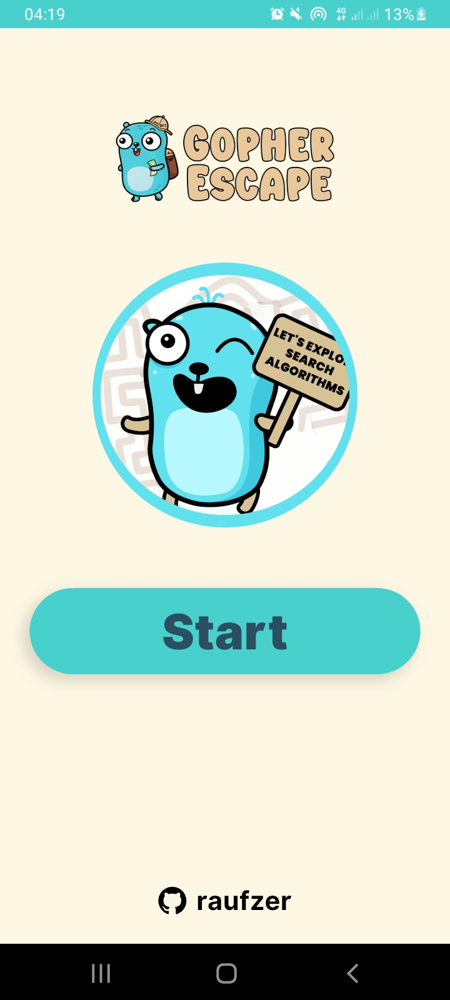
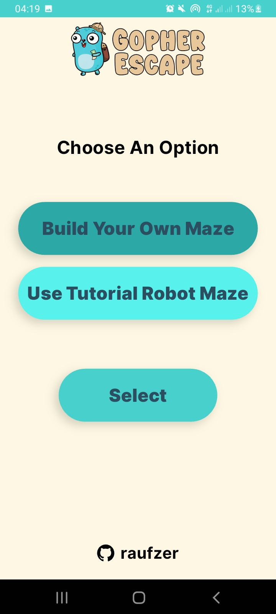
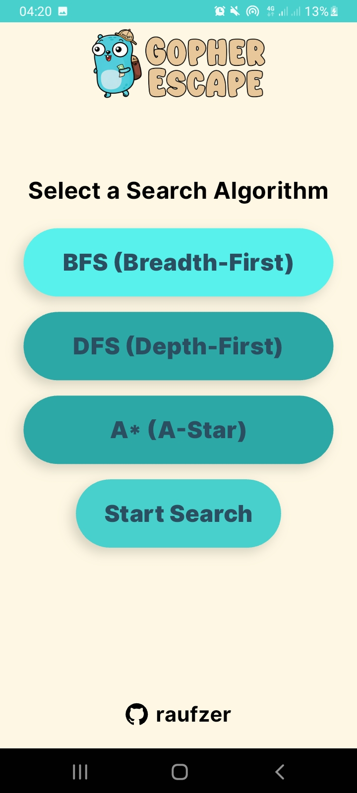
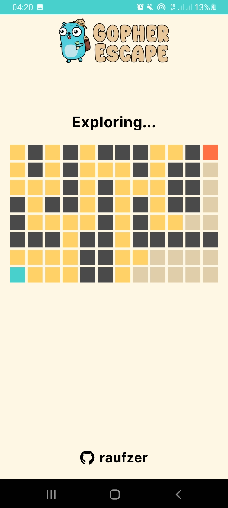
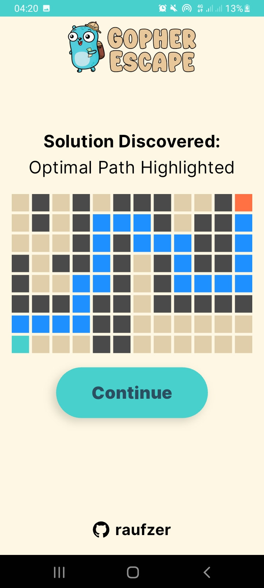
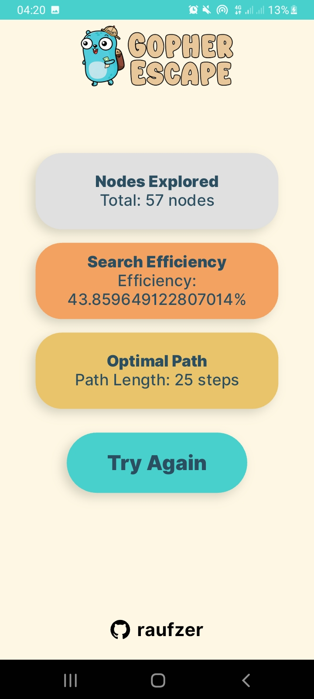

# Gopher Escape App

This project implements a maze-solving application using the **Depth-First Search (DFS)** , **Breadth-First Search (BFS)** and **A star** algorithms. The application visualizes the maze and the solving process, allowing users to generate random mazes and solve them using different algorithms.

---

## Table of Contents

- [Gopher Escape App](#gopher-escape-app)
  - [Table of Contents](#table-of-contents)
  - [Overview](#overview)
  - [Features](#features)
  - [Folder Structure](#folder-structure)
  - [How to Run](#how-to-run)
  - [Example Output](#example-output)
    - [Screenshots](#screenshots)
  - [Dependencies](#dependencies)
  - [Assignment Details](#assignment-details)
  - [Author](#author)
  - [License](#license)

---

## Overview

The goal of this project is to:

- Implement the **DFS** and **BFS** algorithms to solve mazes.
- Allow users to generate random mazes and solve them using different algorithms.
- Visualize the solving process and the final path on an interactive grid.

---

## Features

- **Maze Generation:** Users can generate random mazes with specified dimensions.
- **Multiple Algorithms:** Solve mazes using DFS or BFS algorithms.
- **Visualization:** Displays the solving process and the final path on an interactive grid.
- **User-Friendly:** Easy-to-use interface for generating and solving mazes.

---

## Folder Structure

```
lib/ # Main application directory
├── core/ # Core utilities and configurations
│   ├── config/ # Application routes and settings
│   ├── theme/ # Theme-related styles and configurations
│   ├── utils/ # Utility functions
├── features/ # Main features of the application
│   ├── algorithms/ # Algorithm selection and logic
│   │   ├── application/ # Business logic layer
│   │   ├── presentation/ # UI layer
│   ├── analytics/ # Performance tracking and results analysis
│   │   ├── application/
│   │   ├── presentation/
│   ├── home/ # Home screen components
│   │   ├── presentation/
│   ├── maze/ # Maze generation and solving logic
│   │   ├── application/
│   │   ├── presentation/
│   ├── options/ # User settings and configurations
│   │   ├── application/
│   │   ├── presentation/
├── shared/ # Shared UI components
│   ├── widgets/
├── screenshots/ # Project screenshots
│   ├── algorithms_screen.jpg
│   ├── analytics_screen.jpg
│   ├── exploring_screen.jpg
│   ├── home_screen.jpg
│   ├── maze_screen.jpg
│   ├── options_screen.jpg
│   ├── solution_screen.jpg
├── main.dart # Entry point of the application
```


## How to Run

1. **Install Dependencies:**
   ```bash
   flutter pub get
   ```
2. **Run the Application:**
   ```bash
   flutter run
   ```
3. **Follow the Instructions:**
   - Open the application on your device/emulator.
   - Generate a random maze or input a custom maze.
   - Select the algorithm to solve the maze.
   - View the solving process and the final path on the interactive grid.

---

## Example Output

### Screenshots

| Home Screen  | Options Screen  | Maze Screen  |
| ----------- | ----------- | -------------- |
|  |  |  |

| Algorithms Screen  | Exploring Screen  | Solution Screen  |
| ----------- | ----------- | -------------- |
|  |  |  |

| Analytics Screen  | 
| ----------- | 
|  |

---

## Dependencies

- **Flutter SDK**
- **Libraries:**
  - `flutter_bloc`
  - `equatable`
  - `screenutil`

Install all dependencies using:

```bash
flutter pub get
```

---

## Assignment Details

The full assignment instructions can be found in the `assignment.pdf` file. It includes:

- The problem statement.
- Steps to complete the assignment.

---

## Author

Rauf Zer

École supérieure en Sciences et Technologies de l'Informatique et du Numérique

09/03/2025

---

## License

This project is licensed under the MIT License. See the LICENSE file for details.

