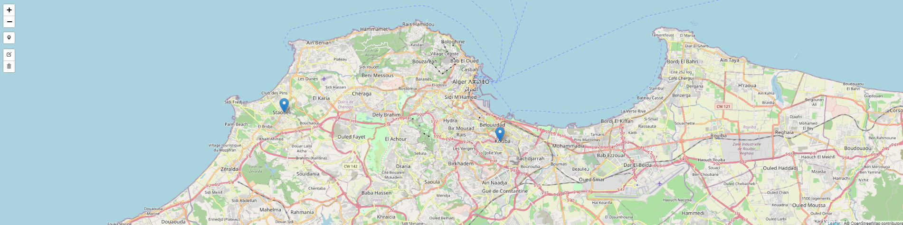
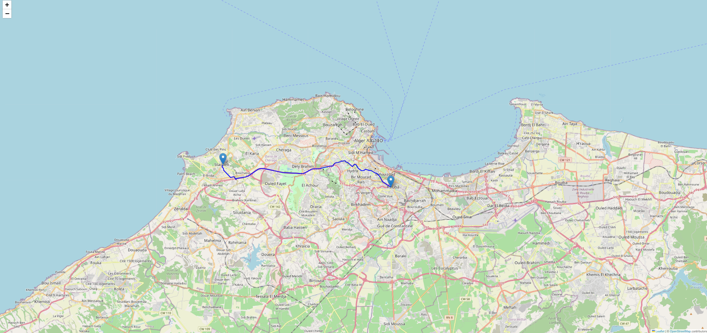

# Shortest Path Between Two Algerian Cities

This project implements the **A\* search algorithm** to find the shortest path between two cities in Algeria using OpenStreetMap data. The path is visualized on an interactive map.

---

## Table of Contents
- [Shortest Path Between Two Algerian Cities](#shortest-path-between-two-algerian-cities)
  - [Table of Contents](#table-of-contents)
  - [Overview](#overview)
  - [Features](#features)
  - [Folder Structure](#folder-structure)
  - [How to Run](#how-to-run)
  - [Example Output](#example-output)
    - [Interactive Map for Point Selection](#interactive-map-for-point-selection)
    - [Shortest Path Visualization](#shortest-path-visualization)
  - [Dependencies](#dependencies)
  - [Assignment Details](#assignment-details)
  - [Dockerization](#dockerization)
    - [Running with Docker](#running-with-docker)
  - [License](#license)
  - [Author](#author)

---

## Overview
The goal of this assignment is to:
- Implement the **A\*** search algorithm to find the shortest path between two cities in Algeria.
- Visualize the path on an interactive map using **Folium**.
- Allow users to select start and end points directly on the map.

---

## Features
- **Interactive Map:** Users can click on the map to select start and end points.
- **Shortest Path Calculation:** Uses the A\* algorithm to find the shortest path.
- **Visualization:** Displays the shortest path on an interactive map.
- **User-Friendly:** No need to manually input coordinates—just click on the map!

---

## Folder Structure
```
shortest-path-algerian-cities/
│
├── cache/ # Cached map data
│   └── algeria_map.html # Interactive map for point selection
├── data/ # Input/output data
│   └── markers.json # User-selected markers
├── results/ # Output files
│   └── shortest_path_map.html # Visualized shortest path
├── screenshots/ # Screenshots of the project
│   ├── interactive_map.png
│   └── shortest_path.png
├── src/ # Source code
│   └── shortest_path.py # Main Python script
├── docker/ # Docker-related files
│   ├── Dockerfile
│   └── docker-compose.yml
├── README.md # Project documentation
├── requirements.txt # List of dependencies
└── assignment.pdf # Full assignment instructions
```

---

## How to Run
1. **Install Dependencies:**
   ```bash
   pip install -r requirements.txt
   ```
2. **Start the Local Web Server:**
   ```bash
   python -m http.server 8000
   ```
3. **Run the Script:**
   ```bash
   python src/shortest_path.py
   ```
4. **Follow the Instructions:**
   - Open the interactive map in your browser.
   - Click on the map to select the start and end points.
   - Save the markers and press Enter in the terminal.
   - View the shortest path on the interactive map.

---

## Example Output
### Interactive Map for Point Selection

### Shortest Path Visualization


---

## Dependencies
- **Python 3.x**
- **Libraries:**
  - `osmnx`
  - `networkx`
  - `folium`
  - `scikit-learn`

Install all dependencies using:
```bash
pip install -r requirements.txt
```

---

## Assignment Details
The full assignment instructions can be found in the `assignment.pdf` file. It includes:
- The problem statement.
- Steps to complete the assignment.
- Bonus tasks (e.g., adding interactivity).

---

## Dockerization
This project has been **Dockerized** for easier setup and deployment.

### Running with Docker
1. **Build the Docker image:**
   ```bash
   docker build -t shortest-path-algeria .
   ```
2. **Run the container:**
   ```bash
   docker run -p 8000:8000 shortest-path-algeria
   ```
3. **Access the application:** Open `http://localhost:8000` in your browser to interact with the map.

---

## License
This project is licensed under the MIT License. See the LICENSE file for details.

---

## Author
Abd Raouf Zerkhef

École supérieure en Sciences et Technologies de l'Informatique et du Numérique

05/03/2025

